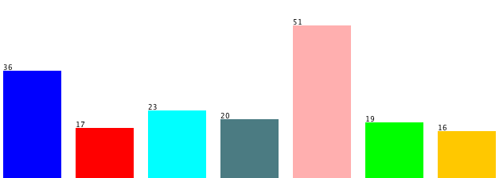
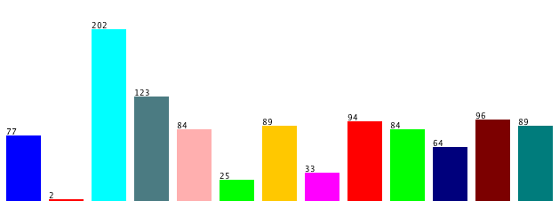
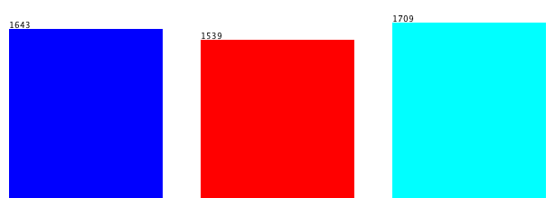

# Embedding Java Classes with code2vec: Improvements from Variable Obfuscation


This repository contains the java obfuscation tool created with [Spoon](https://github.com/INRIA/spoon) and the dataset pipeline as described in: 

[Rhys Compton](https://www.rhyscompton.co.nz/), [Eibe Frank](https://www.cs.waikato.ac.nz/~eibe/), [Panos Patros](https://www.cms.waikato.ac.nz/people/ppatros), and [Abigail Koay](https://www.waikato.ac.nz/staff-profiles/people/akoay) - *Embedding Java Classes with code2vec: Improvements from Variable Obfuscation*, in MSR '20 [[ArXiv Preprint]](https://arxiv.org/abs/2004.02942)

Also included are all models and data used in the paper for reproducing/further research.

## Downloadable Assets
- [Trained Models](https://zenodo.org/record/3577367)
- [Evaluation datasets](https://zenodo.org/record/3575197)

## Requirements
- Java 8+
- Python 3

## Usage - Obfuscator
1. `cd java-obfuscator`
1. Locate a folder of `.java` files (e.g., from the [code2seq](https://github.com/tech-srl/code2seq#datasets) repository)
2. Alter the input and output directories in `obfs-script.sh`, as well as the number of threads of your machine. If you're running this on a particularly large folder (e.g., millions of files) then you may need to increase the `NUM_PARTITIONS` to 3 or 4, otherwise memory issues can occur, grinding the obfuscator to a near halt.
3. Run `obfs-script.sh` i.e. `$ source obfs-script.sh`

This will result in a new obfuscated folder of `.java` files, that can be used to train a new obfuscated code2vec model (or any model that performs learning from source code for that matter).

## Usage - Dataset Pipeline


The pipeline uses a trained code2vec model as a feature extractor, converting a classification dataset of `.java` files into a numerical form (`.arff` by default), that can then be used as input for any standard classifier.

All of the model-related code (`common.py`, `model.py`, `PathContextReader.py`) as well as the `JavaExtractor` folder is code from the original [code2vec repository](https://github.com/tech-srl/code2vec). This was used for invoking the trained code2vec models to create method embeddings - using the code2vec model as a feature extractor.

The dataset should be in the form of those supplied with this paper i.e.:
```
dataset_name
|-- class1
    |-- file1.java
    |-- file2.java
    ...
|-- class2
    |-- file251.java
    |-- file252.java
    ...

...
```

To run the dataset pipeline and create class-level embeddings for a dataset of Java files:
1. `cd pipeline`
2. `pip install -r requirements.txt`
3. Download a `.java` dataset (from the datasets supplied or your own) and put in the `java_files/` directory
4. Download a code2vec model checkpoint and put the checkpoint folder in the `models/` directory
5. Change the paths and definitions in `model_defs.py` and number of models in `scripts/create_datasets.sh` to match your setup
6. Run `create_datasets.sh` (`source scripts/create_datasets.sh`). This will loop through each model and create class-level embeddings for the supplied datasets. The resulting datasets will be in `.arff` format in the `weka_files/` folder. 

You can now perform class-level classification on the dataset using any off-the-shelf WEKA classifier. Note that the dataset contains the original filename as a string attribute for debugging purposes; you'll likely need to remove this attribute before you pass the dataset into a classifier.

### Config
By default the pipeline will use the full range of values for each parameter, which creates a huge number of resulting `.arff` datasets (>1000). To reduce the number of these, remove (or comment out) some of the items in the arrays in `reduction_methods.py` and `selection_methods.py` (at the end of the file). Our experiments showed that the `SelectAll` selection method and `NoReduction` reduction method performed best in most cases so you may want to just keep these.

## Trained code2vec Models

The models are all available for download: [Zenodo Link](https://zenodo.org/record/3577367).

The `.java` datasets used to train each of the models (different versions of `java-large` from the [code2seq repository](https://github.com/tech-srl/code2seq)), as well as the preprocessed code2vec-ready versions of those datasets are also available: [Google Drive Link](https://drive.google.com/open?id=1CXgSXKf292BTlryASui2kBvYvJSvFnWN)

## Datasets

The `.java` datasets collated for this research are all available for download: [Zenodo Link](https://zenodo.org/record/3575197). 

For the interactive embedding visualisation links below, best results are often seen by UMAP.

Class distributions shown below generated by [WEKA](https://www.cs.waikato.ac.nz/ml/weka/)

### OpenCV/Spring

2 categories, 305 instances


[Embedding Visualisation](http://projector.tensorflow.org/?config=https://gist.githubusercontent.com/basedrhys/fbb71520686db5e748e8681de112407c/raw/3900fd07bdc4441cf66f69c4e710611dd7fcecd9/opencv_config.json)


### Algorithm Classification

7 categories, 182 instances



[Embedding Visualisation](http://projector.tensorflow.org/?config=https://gist.githubusercontent.com/basedrhys/5660cf47252411bdf83e4ff4f877f02a/raw/8e53136f79251fdce82524d9fc6539c039f9be63/algorithm_config.json)


### Code Author Attribution

13 categories, 1062 instances



[Embedding Visualisation](http://projector.tensorflow.org/?config=https://gist.githubusercontent.com/basedrhys/36fcd8653f2d759a8f1b03e56502a58e/raw/7d2ddef1c219d4fad7a49cc2c978d1ff4e25e5f1/author_config.json)


### Bug Detection

2 categories, 31135 instances*


### Duplicate File Detection

2 categories, 1669 instances


### Duplicate Function Detection

2 categories, 1277 instances


### Malware Classification 

Can't share dataset for security reasons, however, you can request it from the original authors: http://amd.arguslab.org/

3 categories, 20927 instances*




#### Notes

`*` - 2000 samples per class were randomly sampled during experiments, so the results in the paper are reported on a smaller dataset. The downloadable dataset is the full version. 