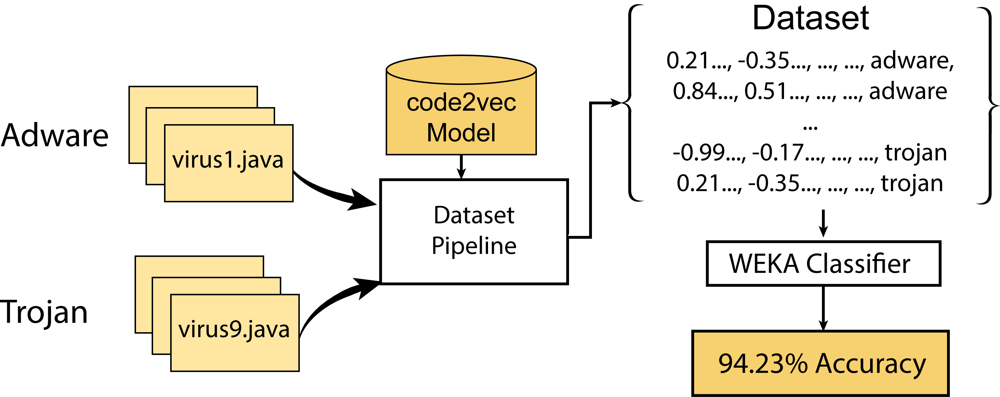
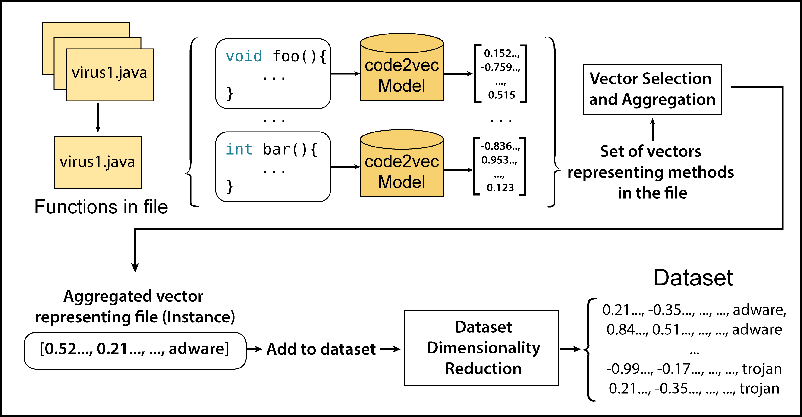
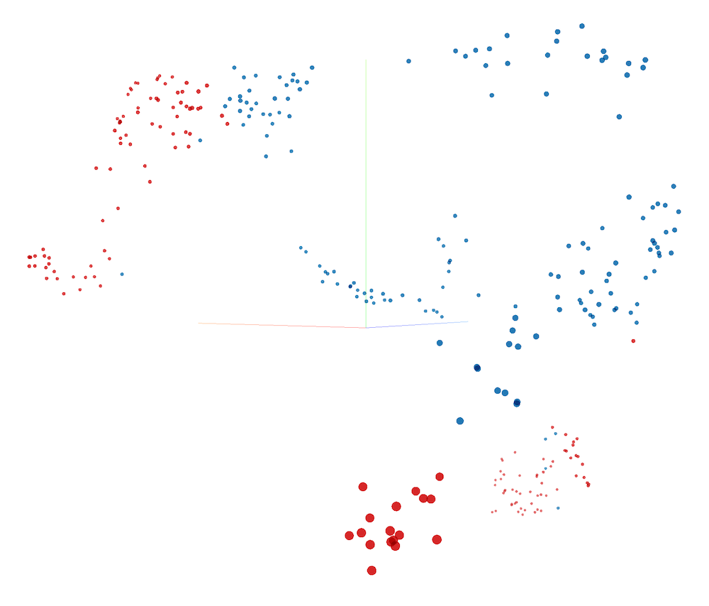
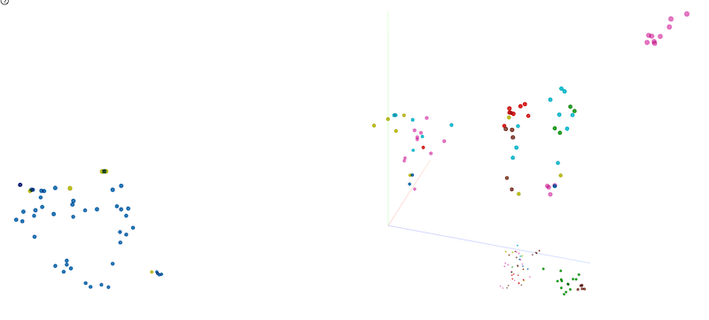
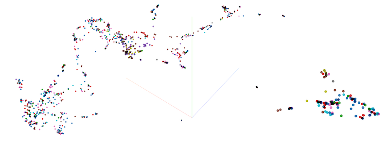

# Obsucated code2vec: Improving Generalisation by Hiding Information

Code for the paper: *Obsucated code2vec: Improving Generalisation by Hiding Information*

This repository contains code for the dataset pipeline, as well as the obfuscation tool used for obfuscating the datasets.

All of the model-related code (`common.py`, `model.py`, `PathContextReader.py`) as well as the `JavaExtractor` folder is code from the original [code2vec repository](https://github.com/tech-srl/code2vec). This was used for invoking the trained code2vec models to create method embeddings.

All models/datasets are on the paper google drive folder
https://drive.google.com/drive/u/1/folders/1CXgSXKf292BTlryASui2kBvYvJSvFnWN

## Usage - Dataset Pipeline

To run the dataset pipeline and create class-level embeddings for a dataset of Java files:
1. Download a `.java` dataset (from the datasets supplied or your own) and put in the `java_files/` directory
2. Download a code2vec model checkpoint and put the checkpoint folder in the `models/` directory
3. Change the paths and definitions in `model_defs.py` and number of models in `create_datasets.sh` to match your setup
4. Run `create_datasets.sh`. This will loop through each model and create class-level embeddings for the supplied datasets. The resulting datasets will be in `.arff` format in the `weka_files/` folder

### Config
By default the pipeline will use the full range of values for each parameter, which creates a huge number of resulting `.arff` datasets (>1000). To reduce the number of these, remove (or comment out) some of the items in the arrays in `reduction_methods.py` and `selection_methods.py` (at the end of the file). Our experiments showed that the `SelectAll` selection method and `NoReduction` reduction method performed best in most cases so you may want to keep only these.

## Datasets

For embedding visualisations, the UMAP option (in the projector) usually shows the most interesting results.
The `.java` files are all [available for download](https://drive.google.com/drive/u/1/folders/1HALdnw8GO62HmYoGWxa4aX3XToEXAoGk). 
### OpenCV/Spring

2 categories, 305 instances

[Google Drive Link](https://drive.google.com/open?id=1WenQenDHMNOfQl_h0OaC25MHMNQF4xmS)

[Embedding Visualisation](http://projector.tensorflow.org/?config=https://gist.githubusercontent.com/basedrhys/fbb71520686db5e748e8681de112407c/raw/3900fd07bdc4441cf66f69c4e710611dd7fcecd9/opencv_config.json)

### Algorithm Classification

7 categories, 182 instances

[Google Drive Link](https://drive.google.com/open?id=16NPxqFEwkPFezSiZ1Ln6a_NoQWqaV6hy)

[Embedding Visualisation](http://projector.tensorflow.org/?config=https://gist.githubusercontent.com/basedrhys/5660cf47252411bdf83e4ff4f877f02a/raw/8e53136f79251fdce82524d9fc6539c039f9be63/algorithm_config.json)

### Code Author Attribution

13 categories, 1062 instances

[Google Drive Link](https://drive.google.com/open?id=1IC0Nxeew73p9yvfhKcKH-6mxW8nHGyfn)

[Embedding Visualisation](http://projector.tensorflow.org/?config=https://gist.githubusercontent.com/basedrhys/36fcd8653f2d759a8f1b03e56502a58e/raw/7d2ddef1c219d4fad7a49cc2c978d1ff4e25e5f1/author_config.json)

### Bug Detection

2 categories, 3344 instances

[Google Drive Link](https://drive.google.com/open?id=1KXGIDg9fJf334D967Md22bUai_41IZl1)

### Duplicate File Detection

2 categories, 1669 instances

[Google Drive Link](https://drive.google.com/open?id=1xkHyN-Jet8y8cNEQvX3Uf0s5ZdUWmcV5)

### Duplicate Function Detection

2 categories, 1277 instances

[Google Drive Link](https://drive.google.com/open?id=1_0Ai-DzotMtehcYkIRmNLq66-ZfAckuS)

### Malware Classification 

3 categories, 4891 instances

Can't share dataset for security reasons, you can request it from the original authors: http://amd.arguslab.org/